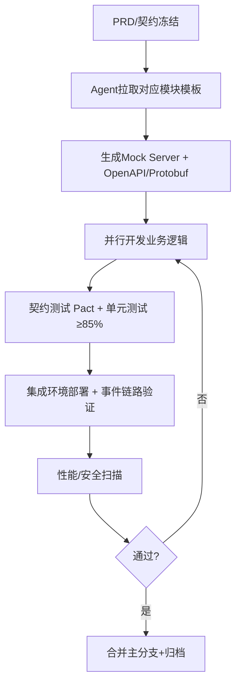

# 🏥 新一代智能医院信息系统(HIS) 产品需求说明书

> **版本**: v1.0.0  
> **最后更新**: 2024-05  
> **适用标准**: 国家卫健委《医院信息互联互通标准化成熟度测评(2023版)》《电子病历系统应用水平分级评价》《网络安全等级保护2.0(三级)》《个人信息保护法》《数据安全法》  
> **生成目标**: 面向多智能体(Multi-Agent)代码生成与微服务架构落地，提供强契约化、边界清晰、可扩展的模块化需求规范。

---

## 1. 概述

### 1.1 产品定位
面向公立/私立医疗机构的下一代云原生HIS系统，采用微服务架构、事件驱动通信、FHIR标准化数据模型，内置临床决策支持(CDS)、智能排班、医保直连、全链路审计与多租户隔离能力。支持“一次建设、分级部署、平滑演进”。

### 1.2 目标用户
| 角色 | 核心诉求 |
|------|----------|
| 医师 | 结构化病历、CDS提醒、一键开医嘱、移动端查房 |
| 护士 | 床旁执行闭环、体征采集、护理计划、扫码核对 |
| 药师 | 处方审核、库存预警、静配中心(PD)对接 |
| 收费/财务 | 多渠道结算、医保实时对账、发票/票据管理 |
| 患者 | 预约挂号、报告查询、在线支付、随访 |
| 信息科 | 统一权限、日志审计、数据治理、灰度发布、监控告警 |

### 1.3 设计原则
1. **契约优先(Contract-First)**: 所有模块交互必须通过 OpenAPI 3.0 / Protobuf / AsyncAPI 定义，禁止跨模块直连数据库。
2. **领域驱动(DDD)**: 按有界上下文划分模块，核心域与支撑域隔离，共享内核仅存不可变字典表。
3. **事件驱动**: 状态变更通过消息总线广播，支持异步补偿与最终一致性。
4. **合规内置**: 审计追踪、数据脱敏、电子签章、等保三级控制项默认启用。
5. **离线韧性**: 核心临床与收费链路支持断网缓存+网络恢复自动同步。

---

## 2. 整体架构与技术栈

```
┌─────────────────────────────────────────────────────────────┐
│                         客户端层 (Frontend)                 │
│  Web端(React/Vue3+PWA) │ 移动端(React Native/Flutter)      │
└───────────────┬───────────────────────┬─────────────────────┘
                │ HTTPS / gRPC-Web      │ WebSocket / SSE
┌───────────────▼───────────────────────▼─────────────────────┐
│                     API 网关 / BFF 层                        │
│  RateLimit │ WAF │ JWT验证 │ 动态路由 │ 灰度路由 │ 请求聚合  │
└───────────────┬───────────────────────┬─────────────────────┘
                │ gRPC (同步) / REST    │ Kafka / NATS (异步)
┌───────────────▼───────────────────────▼─────────────────────┐
│                      微服务域 (Microservices)                │
│  [患者/排班] [EMR/CDS] [CPOE] [药房] [收费/医保] [护理]      │
│  [物资] [报表/AI] [集成引擎] [权限/审计] [消息总线/网关]     │
└───────────────┬───────────────────────┬─────────────────────┘
                │ SQL/NoSQL 访问        │ 缓存/搜索 访问
┌───────────────▼───────────────────────▼─────────────────────┐
│                      数据与基础设施层                        │
│  PostgreSQL │ Redis │ MongoDB │ ClickHouse │ MinIO │ ES     │
│  Kubernetes │ Istio │ ArgoCD │ Prometheus │ Jaeger │ ELK     │
└─────────────────────────────────────────────────────────────┘
```

### 2.1 技术选型约束
| 层级 | 推荐栈 | 强制约束 |
|------|--------|----------|
| 语言 | Go(业务服务) / Python(AI/CDS) / Java(医保对接) | 禁止使用已EOL版本，需支持OpenTelemetry |
| 通信 | REST(公开API) / gRPC(内部同步) / Kafka(事件) | 全链路TraceID透传，失败重试指数退避+死信队列 |
| 存储 | 主数据: PostgreSQL 15+ 缓存: Redis 7+ 文档: MongoDB | 强制行级安全(RLS)，多租户Schema隔离 |
| 部署 | K8s + Helm + Istio ServiceMesh | 支持Helm值覆盖，镜像签名验证，SBOM生成 |

---

## 3. 核心模块详细需求

> 📌 **多Agent开发提示**: 每个模块为独立Git仓库，Agent需严格遵循下方定义的`边界`、`契约`、`事件`与`约束`。跨模块调用仅允许通过网关或事件总线。

### 3.1 患者主索引与挂号预约模块 (`his-empi-scheduler`)

#### 🔲 功能边界
- 负责：患者身份核验、EMPI生成、号源池管理、多渠道预约、队列叫号。
- 不负责：临床诊断、收费结算、床位分配。

#### 📦 核心功能
- 多源身份融合（身份证/医保电子凭证/电子健康卡/人脸）
- EMPI规则引擎（模糊匹配+置信度评分+人工复核队列）
- 智能排班引擎（科室/医师/时段/号类动态配置）
- 预约冲突检测（防超挂、爽约规则、黑名单策略）
- 实时队列管理（优先级分诊、过号处理、跨院转诊预留）

#### ⚖️ 业务约束
- 必须实名制；未实名仅允许急诊通道临时建档（24h内补录）
- 号源释放规则：提前24h/2h/30min阶梯释放，支持锁号超时释放
- 预约成功率SLA ≥ 99.9%，叫号延迟 ≤ 1.5s
- 爽约≥3次自动限制线上预约（可申诉解锁）

#### 🗃️ 核心数据模型
```json
{
  "Patient": {"id":"uuid","emri_id":"string","name":"string","gender":"M|F|O","id_type":"string","id_no":"hashed","birth_date":"date","phone":"masked","status":"active|merged|deceased"},
  "Schedule": {"id":"uuid","dept_id":"uuid","doctor_id":"uuid","date":"date","slot_capacity":"int","slot_available":"int","type":"regular|expert|special","status":"open|locked|closed"},
  "Appointment": {"id":"uuid","patient_id":"uuid","schedule_id":"uuid","slot":"string","channel":"app|web|kiosk|call","status":"confirmed|checked_in|cancelled|no_show"}
}
```

#### 🔌 接口契约
| 方法 | 路径 | 说明 | 认证 |
|------|------|------|------|
| POST | `/v1/patients/verify` | 身份核验返回EMPI | OAuth2+设备指纹 |
| GET  | `/v1/schedules` | 查询可用号源（分页/过滤） | 公开(限频) |
| POST | `/v1/appointments` | 预约下单 | 患者Token+签名 |
| PATCH| `/v1/appointments/{id}/status` | 状态流转 | 内部服务调用 |

#### 📡 异步事件
| Topic | Payload | 消费者 |
|-------|---------|--------|
| `patient.empi.created` | `{patient_id, empi_id, source}` | EMR, CPOE, Analytics |
| `appointment.confirmed` | `{id, patient_id, schedule_id}` | 通知服务, 门诊大屏 |
| `queue.called` | `{dept, doctor, queue_no}` | 叫号终端, 移动端推送 |

---

### 3.2 电子病历与临床文档模块 (`his-emr-cds`)

#### 🔲 功能边界
- 负责：结构化病历书写、版本控制、CA电子签名、CDS规则引擎、文档归档。
- 不负责：医嘱执行状态跟踪、计费、护理操作记录。

#### 📦 核心功能
- 模板驱动编辑器（支持SOAP/病程记录/手术记录/出院小结）
- 时间轴视图（按就诊/时间/系统聚合文档）
- 强制质控点拦截（必填项校验、逻辑矛盾提示、签名完整性）
- CDS Hook对接（过敏警示、相互作用、指南推荐、重复用药拦截）
- 文档防篡改存储（哈希上链/国密SM3+时间戳）

#### ⚖️ 业务约束
- 修改留痕：任何编辑生成新版本，旧版本只读且可追溯
- 签名时效：开立后30min内需完成CA签名，超时锁定为“草稿”
- 隐私控制：敏感字段（HIV/精神类）需双因子授权+访问审批日志
- 合规映射：严格遵循《电子病历基本数据集 WS 445-2014》

#### 🗃️ 核心数据模型
```json
{
  "Encounter": {"id":"uuid","patient_id":"uuid","type":"outpatient|inpatient|er","status":"planned|in_progress|finished"},
  "Document": {"id":"uuid","encounter_id":"uuid","author_id":"uuid","type":"progress|consult|surgery","version":"int","content_hash":"hex","status":"draft|signed|archived"},
  "CDSSeverity": {"id":"string","code":"high|medium|low","message":"string","action_required":"bool","override_reason":"string|null"}
}
```

#### 🔌 接口契约
| 方法 | 路径 | 说明 | 认证 |
|------|------|------|------|
| POST | `/fhir/DocumentReference` | 提交临床文档(FHIR R4) | 医师Token |
| GET  | `/fhir/Composition/{id}` | 获取文档结构 | RBAC+Scope |
| POST | `/v1/cds-hook/evaluate` | CDS规则评估(同步) | 内部调用 |
| PATCH| `/v1/documents/{id}/sign` | CA签名绑定 | CA硬件网关回调 |

#### 📡 异步事件
| Topic | Payload | 消费者 |
|-------|---------|--------|
| `emr.document.signed` | `{doc_id, encounter_id, author}` | CPOE, 质控引擎, 归档服务 |
| `cds.alert.triggered` | `{rule_id, severity, patient_id, context}` | 医师工作台, 审计系统 |
| `emr.encounter.closed` | `{encounter_id, discharge_summary_ref}` | 病案管理, 医保对账 |

---

### 3.3 医嘱管理模块 (`his-cpoe`)

#### 🔲 功能边界
- 负责：医嘱开立、审核、执行状态追踪、套餐管理、临时/长期医嘱转换。
- 不负责：病历书写、药品库存扣减、护理床旁执行。

#### 📦 核心功能
- 智能开单（拼音/拼音码/诊断联想、历史医嘱复用、临床路径绑定）
- 多级审核流（主管医师→科室主任→医务科，支持紧急跳过）
- 执行闭环（开立→审核→发药/检查→执行→反馈）
- 套餐与路径管理（DRG/DIP病种标准化医嘱包）
- 停药/改单/作废审计链

#### ⚖️ 业务约束
- 长期医嘱默认每日自动续开，需手动停用
- 危急值医嘱需强制语音/短信双通道通知
- 跨科医嘱需目标科室接收确认后方可执行
- 医保目录外药品/项目需二次知情同意电子确认

#### 🗃️ 核心数据模型
```json
{
  "Order": {"id":"uuid","encounter_id":"uuid","order_type":"drug|lab|imaging|procedure|nursing","status":"draft|audited|active|suspended|completed|cancelled"},
  "OrderItem": {"id":"uuid","order_id":"uuid","code":"string","quantity":"int","frequency":"string","route":"string","duration_days":"int","start_time":"ts","stop_time":"ts"},
  "AuditLog": {"id":"uuid","order_id":"uuid","actor_id":"uuid","action":"create|approve|modify|cancel","timestamp":"ts","ip":"string"}
}
```

#### 🔌 接口契约
| 方法 | 路径 | 说明 | 认证 |
|------|------|------|------|
| POST | `/v1/orders` | 批量开立医嘱 | 医师Token |
| PATCH| `/v1/orders/{id}/status` | 审核/停用/作废 | 角色+审批流权限 |
| GET  | `/v1/orders/execution-status` | 查询执行进度 | 医护Token |
| POST | `/v1/orders/pathway/apply` | 应用临床路径包 | 路径权限 |

#### 📡 异步事件
| Topic | Payload | 消费者 |
|-------|---------|--------|
| `cpoe.order.audited` | `{order_id, auditor_id}` | 药房, 检查中心, 护理站 |
| `cpoe.order.executed` | `{order_id, executor_id, timestamp}` | CPOE状态机, 报表服务 |
| `cpoe.order.cancelled` | `{order_id, reason, actor_id}` | 库存回滚, 计费拦截, 通知 |

---

### 3.4 药房与库存管理模块 (`his-pharmacy-inventory`)

#### 🔲 功能边界
- 负责：药品/耗材入库、效期管理、处方审核、发药/退药、库存预警、批次追踪。
- 不负责：临床用药决策、医嘱开立逻辑、财务应收应付。

#### 📦 核心功能
- 批次/效期FIFO/FEFO策略
- 处方合理性审核（超量、配伍、禁忌、医保限制）
- 自动化发药机/PDCA对接接口
- 盘点/报损/调拨电子流程
- 麻精毒特殊药品双人双锁电子台账

#### ⚖️ 业务约束
- 近效期预警：距过期90/60/30/7天分级预警，自动拦截发放
- 特殊药品：批号全量追溯，操作需生物识别+双人复核
- 库存低于安全库存自动触发采购申请单
- 退药需原处方关联，超过24h需药师主管审批

#### 🗃️ 核心数据模型
```json
{
  "Inventory": {"sku_id":"string","batch_no":"string","location":"string","qty":"int","exp_date":"date","status":"available|quarantined|expired"},
  "Dispensing": {"id":"uuid","prescription_ref":"uuid","status":"queued|dispensed|cancelled","items":[{"sku":"string","qty":"int"}]},
  "Reconciliation": {"id":"uuid","type":"cycle|spot|adjust","initiator":"uuid","approved_by":"uuid","status":"pending|completed"}
}
```

#### 🔌 接口契约
| 方法 | 路径 | 说明 | 认证 |
|------|------|------|------|
| POST | `/v1/inventory/receive` | 入库登记 | 药房/库管Token |
| GET  | `/v1/inventory/check` | 查询可用量/批次 | 公开(内部) |
| POST | `/v1/dispensing/queue` | 提交发药请求 | CPOE内部调用 |
| POST | `/v1/reconciliation` | 发起盘点 | 角色+审批权限 |

#### 📡 异步事件
| Topic | Payload | 消费者 |
|-------|---------|--------|
| `inventory.low_stock` | `{sku_id, location, current_qty}` | 采购系统, 采购Agent |
| `pharmacy.dispensed` | `{dispense_id, items[], batch_trace}` | CPOE闭环, 计费结算 |
| `expiry.near` | `{sku_id, exp_date, qty}` | 预警看板, 清理任务 |

---

### 3.5 收费与医保结算模块 (`his-billing-insurance`)

#### 🔲 功能边界
- 负责：费用明细生成、多渠道支付、医保实时结算、发票/电子票据、对账/退费。
- 不负责：临床决策、库存管理、床位调度。

#### 📦 核心功能
- 费用自动归集（医嘱/检查/药品/耗材/服务）
- 医保三大目录映射（ICD-10/手术操作码/药品目录）
- 混合支付（医保+自费+商保+信用付）
- 电子发票/财政票据自动开具
- 日结/月结/医保对账差异处理

#### ⚖️ 业务约束
- 费用明细与医嘱执行1:1绑定，未执行不得计费
- 医保结算必须通过国家医保局标准SDK，失败降级为自费
- 退费需原路返回，部分退费需财务主管授权
- 等保要求：交易流水全量加密存储，密钥硬件(HSM)管理

#### 🗃️ 核心数据模型
```json
{
  "Bill": {"id":"uuid","encounter_id":"uuid","total_amount":"decimal","paid_amount":"decimal","status":"unpaid|partial|settled|refunded"},
  "LineItem": {"id":"uuid","bill_id":"uuid","service_code":"string","qty":"int","unit_price":"decimal","insurance_covered":"bool","patient_share":"decimal"},
  "Payment": {"id":"uuid","bill_id":"uuid","channel":"cash|card|wechat|alipay|insurance","transaction_id":"string","status":"success|pending|failed"}
}
```

#### 🔌 接口契约
| 方法 | 路径 | 说明 | 认证 |
|------|------|------|------|
| POST | `/v1/bills/generate` | 生成费用清单 | 计费Agent调用 |
| POST | `/v1/payments/insurance` | 医保预结算 | 医保网关代理 |
| GET  | `/v1/reconciliation/daily` | 日结报表导出 | 财务角色 |
| POST | `/v1/refunds/apply` | 发起退费流程 | 角色+审批流 |

#### 📡 异步事件
| Topic | Payload | 消费者 |
|-------|---------|--------|
| `bill.generated` | `{bill_id, encounter_id, items[]}` | 患者端, 医保接口, 报表 |
| `payment.settled` | `{bill_id, channel, tx_id, receipt_url}` | EMR状态更新, 归档 |
| `reconciliation.mismatch` | `{bill_id, diff_amount, reason}` | 审计, 财务工单系统 |

---

### 3.6 护理工作站模块 (`his-nursing-station`)

#### 🔲 功能边界
- 负责：床位分配、护理计划、体征采集、医嘱执行扫码核对、交接班、护理文书。
- 不负责：病历诊断书写、药品采购、费用减免审批。

#### 📦 核心功能
- 移动PDA床旁执行（三查八对扫码）
- 动态体征录入与趋势图生成
- 跌倒/压疮/疼痛等护理评估量表
- 智能排班与人力负荷监控
- 电子交接班（结构化+语音转写）

#### ⚖️ 业务约束
- 扫码执行必须与医嘱状态机联动，防漏执行/错执行
- 生命体征异常自动触发预警推送至值班护士站
- 交接班未完成不可下班，系统记录时间戳与责任链
- 护理记录修改需上级护士长审核（非主管护士）

#### 🗃️ 核心数据模型
```json
{
  "Ward": {"id":"uuid","name":"string","bed_capacity":"int","available":"int","dept_id":"uuid"},
  "Task": {"id":"uuid","order_ref":"uuid","patient_bed":"string","type":"admin|monitor|procedure","status":"pending|scanned|done|skipped"},
  "VitalSign": {"id":"uuid","patient_id":"uuid","recorded_by":"uuid","bp_sys":"int","bp_dia":"int","hr":"int","temp":"float","spo2":"float","recorded_at":"ts"}
}
```

#### 🔌 接口契约
| 方法 | 路径 | 说明 | 认证 |
|------|------|------|------|
| GET  | `/v1/tasks/shift` | 获取本班待执行任务 | 护士Token |
| POST | `/v1/tasks/verify` | 扫码执行确认 | 设备证书+用户Token |
| POST | `/v1/vitals` | 提交体征数据 | PDA客户端 |
| PATCH| `/v1/handover/submit` | 提交交接班记录 | 护士长权限 |

#### 📡 异步事件
| Topic | Payload | 消费者 |
|-------|---------|--------|
| `task.executed` | `{task_id, nurse_id, timestamp}` | CPOE状态机, 质控 |
| `vitals.abnormal` | `{patient_id, metric, value, threshold}` | CDS, 预警中心, 医师端 |
| `handover.submitted` | `{ward, shift, nurse_ids, summary_ref}` | 排班引擎, 审计日志 |

---

### 3.7 集成引擎与第三方对接 (`his-integration-engine`)

#### 🔲 功能边界
- 负责：HL7/FHIR转换、DICOM路由、医保/公卫平台对接、数据订阅/发布、协议适配。
- 不负责：业务逻辑实现、UI渲染、本地数据持久化。

#### 📦 核心功能
- HL7 v2.x → FHIR R4 双向映射引擎
- DICOM C-STORE/C-MOVE 转发与Web Viewer接入
- 国家医保局/区域卫生信息平台标准报文封装
- 数据订阅过滤（按机构/角色/事件类型）
- 失败重试/死信/人工干预台

#### ⚖️ 业务约束
- 所有对外接口必须通过集成引擎代理，禁止直连
- 转换规则版本化管理，支持A/B测试与灰度
- 敏感字段脱敏策略按接收方等级动态生效
- 传输强制TLS 1.3+国密套件，双向证书认证

#### 🔌 接口契约
| 协议 | 端口/路径 | 说明 | 认证 |
|------|-----------|------|------|
| HL7 MLLP | `5000` | ADT/ORM/ORU 消息接收 | 证书IP白名单 |
| FHIR REST | `/fhir` | Patient/Encounter/Observation | OAuth2+Audience |
| DICOM Web | `/dicom-web` | QIDO-RS/WADO-RS | 角色Scope |
| Webhook | `/subscribe/{topic}` | 事件推送 | HMAC签名验证 |

---

### 3.8 数据报表与智能分析模块 (`his-analytics-ai`)

#### 🔲 功能边界
- 负责：运营指标、质控指标、DRG/DIP分组预测、AI辅助诊断提示、数据导出。
- 不负责：实时交易处理、患者隐私明文展示、临床最终决策。

#### 📦 核心功能
- 预计算指标仓（就诊量、床位使用率、药占比、平均住院日）
- 实时看板（WebSocket推送关键阈值）
- DRG/DIP分组模拟器与费用预测
- AI模型服务（影像初筛、病历质控、再入院风险预测）
- 自定义报表设计器（拖拽字段、SQL沙箱）

#### ⚖️ 业务约束
- 分析数据必须脱敏聚合，禁止导出含明文患者标识的明细
- 模型输出必须带置信度与免责声明，不可直接干预诊疗
- 数据延迟：T+0延迟≤5min，T+1准确率100%
- 计算任务资源隔离，不影响在线业务SLA

#### 🔌 接口契约
| 方法 | 路径 | 说明 | 认证 |
|------|------|------|------|
| POST | `/v1/reports/generate` | 提交报表计算任务 | BI角色 |
| GET  | `/v1/reports/{id}/download` | 下载导出结果 | 下载凭证(短时) |
| POST | `/v1/ai/analyze` | 触发AI分析 | 内部服务调用 |
| WS   | `/ws/dashboard` | 实时指标推送 | Token订阅 |

---

## 4. 非功能性需求与合规约束

### 4.1 性能与可用性
| 指标 | 目标值 | 测试方式 |
|------|--------|----------|
| P95响应时间 | ≤ 800ms (核心事务) | Locust/JMeter压测 |
| 并发在线用户 | ≥ 5,000 | 分布式负载模拟 |
| 可用性 | 99.95% (全年停机≤4.38h) | 故障注入/混沌工程 |
| 数据恢复 | RPO ≤ 5min, RTO ≤ 30min | 定期灾备演练 |

### 4.2 安全与合规
- **身份认证**: OAuth2.0 + JWT + 多因子(MFA) + 国密SM2/SM4
- **访问控制**: RBAC + ABAC(基于科室/患者归属/时间/IP)
- **审计日志**: 全量操作留痕，防篡改存储，保留≥3年
- **隐私保护**: 敏感数据字段级加密，导出脱敏，同意管理(Consent API)
- **等保三级**: 物理/网络/主机/应用/数据五域控制项全覆盖
- **合规审计**: 自动输出《电子病历评级》《互联互通测评》自查报告模板

---

## 5. 接口协议与集成规范

### 5.1 契约管理
```yaml
# OpenAPI 3.0 模板示例片段
components:
  securitySchemes:
    BearerAuth:
      type: http
      scheme: bearer
      bearerFormat: JWT
  schemas:
    Error:
      type: object
      properties:
        code: {type: string, enum: [400,401,403,404,409,500]}
        message: {type: string}
        trace_id: {type: string}
```

### 5.2 事件规范 (AsyncAPI)
- 消息格式: CloudEvents 1.0
- Schema: JSON Schema + Protobuf (双序列化支持)
- 重试策略: 3次指数退避(1s, 2s, 4s) → 死信队列 → 人工干预台
- 顺序保证: 同一`aggregate_id`路由到同分区，保证局部有序

### 5.3 跨模块通信禁令
🚫 **严禁**:
1. 服务A直连服务B数据库
2. 跨模块共享Session/Redis Key命名空间
3. 未定义事件Topic的广播发布
4. 同步长事务跨越3个以上服务

✅ **必须**:
1. 通过网关路由或gRPC内部调用
2. 异步事件最终一致性，补偿事务(Saga)兜底
3. 契约变更需PR评审+Mock Server更新+消费者兼容测试

---

## 6. 多Agent协同开发指南

### 6.1 Agent分工矩阵
| Agent角色 | 负责模块 | 输出产物 | 验收标准 |
|-----------|----------|----------|----------|
| `Agent-EMPI` | 患者/排班 | 微服务+OpenAPI+DB迁移 | 预约流程自动化测试通过 |
| `Agent-EMR` | 病历/CDS | FHIR服务+签名网关+质控规则 | 文档版本链完整，CDS延迟<200ms |
| `Agent-CPOE` | 医嘱管理 | 状态机+审核流+路径包 | 闭环执行率≥99.5% |
| `Agent-Rx` | 药房/库存 | 效期引擎+发药队列+盘点 | 批次追溯准确，零超发 |
| `Agent-Bill` | 收费/医保 | 计费引擎+支付适配+对账 | 医保直连通过率≥98% |
| `Agent-Nursing` | 护理站 | PDA客户端+任务流+体征 | 扫码核对零漏检，预警实时 |
| `Agent-Integ` | 集成引擎 | HL7/FHIR转换器+路由+重试 | 协议转换准确率100% |
| `Agent-Obs` | 监控/部署 | K8s Helm+Grafana+CI/CD | 一键部署，SLA达标 |
| `Agent-QA` | 测试/安全 | 契约测试+渗透报告+压测 | 零高危漏洞，性能达标 |

### 6.2 开发工作流


### 6.3 代码生成约束提示词模板
```text
你是一名资深医疗系统架构师。请严格遵循以下约束生成代码：
1. 仅实现指定模块，禁止越权访问其他模块数据。
2. 所有外部调用必须通过网关或消息总线。
3. 数据库表使用小写snake_case，主键统一UUIDv7。
4. 错误返回统一遵循 OpenAPI Error Schema。
5. 包含完整单元测试、契约测试桩、Dockerfile、Helm values。
6. 关键事务使用Saga或本地消息表保证最终一致性。
输出：完整项目结构、核心代码、API定义、测试用例、部署脚本。
```

---

## 7. 部署、运维与演进路线图

### 7.1 部署拓扑
- **核心生产**: 双可用区K8s集群，跨AZ数据同步，读写分离
- **灾备**: 异地冷备+关键服务热备，一键切换
- **开发/测试**: 共享命名空间，数据脱敏快照注入
- **边缘节点**: 基层卫生院/急诊车部署轻量版(离线缓存+定期同步)

### 7.2 监控与可观测性
- **Metrics**: Prometheus + 自定义SLO告警（错误预算消耗>5%触发）
- **Logs**: ELK + 结构化JSON，敏感字段自动遮蔽
- **Traces**: Jaeger/SkyWalking 全链路透传，慢SQL自动采样
- **Dashboards**: 按角色定制（运维/开发/管理/临床）

### 7.3 演进路线
| 阶段 | 目标 | 交付物 |
|------|------|--------|
| V1.0 | 核心闭环上线 | 挂号→EMR→CPOE→药房→收费→护理 |
| V1.5 | 集成与医保 | 区域平台对接、医保实时结算、PACS/LIS打通 |
| V2.0 | 智能与数据驱动 | AI辅诊、DRG/DIP分组预测、运营数字孪生 |
| V2.5 | 生态开放 | 第三方应用市场、患者健康档案共享、医联体协同 |

---

## 附录

### A. 术语表
| 缩写 | 全称 | 说明 |
|------|------|------|
| EMPI | Enterprise Master Patient Index | 企业级患者主索引 |
| CPOE | Computerized Physician Order Entry | 医师计算机医嘱录入 |
| FHIR | Fast Healthcare Interoperability Resources | 快速医疗互操作资源标准 |
| DICOM | Digital Imaging and Communications in Medicine | 医学影像通信标准 |
| DRG/DIP | Diagnosis Related Groups / Big Data Diagnosis-Intervention Packet | 医保支付分组标准 |

### B. 参考规范
- 《医院信息互联互通标准化成熟度测评方案（2023版）》
- 《电子病历系统功能应用水平分级评价标准》
- HL7 FHIR R4 / CDA R2 / v2.x Implementation Guides
- 国家医疗保障局《医保信息平台接口规范》
- GB/T 22239-2019 信息安全技术 网络安全等级保护基本要求

### C. 文档维护
本PRD采用版本控制，变更需经架构委员会评审。代码生成前需校验对应模块OpenAPI/Protobuf版本一致性。多Agent开发时，请严格遵循`# 6.3 代码生成约束提示词模板`执行。

